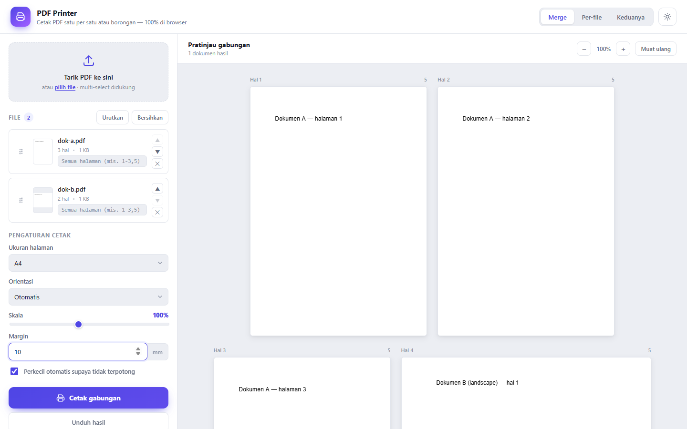
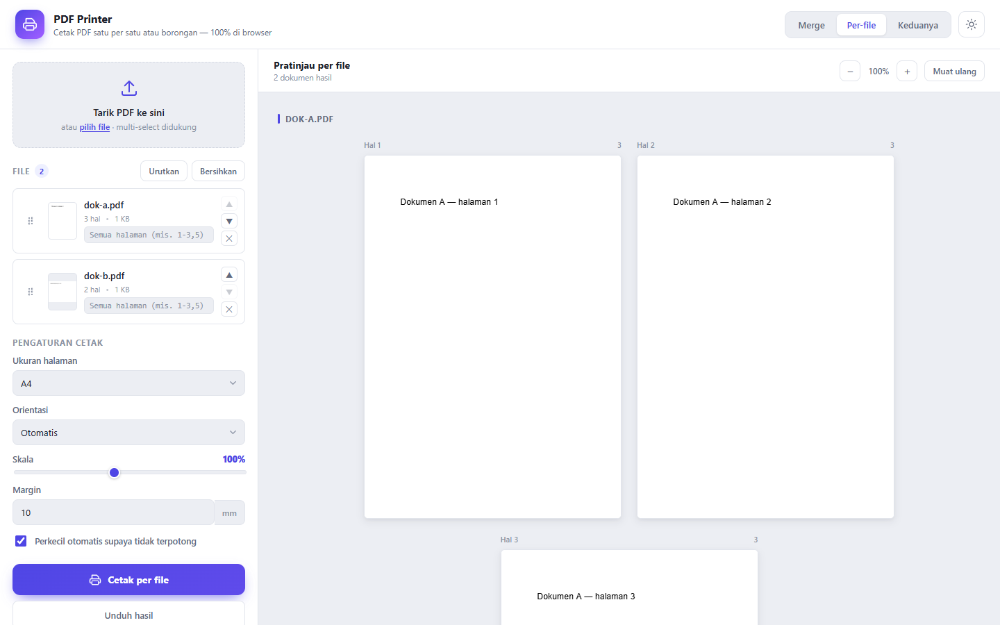
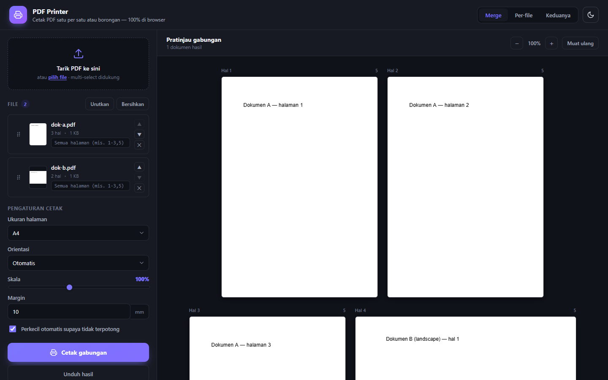

# PDF Printer

[](https://j0yfullness.github.io/pdf-printer/)
[](https://j0yfullness.github.io/pdf-printer/)


[](https://pdf-lib.js.org/)
[](https://mozilla.github.io/pdf.js/)

A static web app for printing PDFs — one file at a time or many in bulk. Everything runs in the browser; no file is ever uploaded to a server.

**Live demo:** https://j0yfullness.github.io/pdf-printer/

## Screenshots

**Merge mode (light theme)**



**Per-file mode**



**Dark theme**



## Features

- Add multiple PDFs via drag & drop or the file picker.
- Print modes:
  - **Merge** — all PDFs are combined into a single document, then one print dialog.
  - **Per-file** — each PDF is printed separately, queued with a progress indicator.
  - **Both** — choose the method when you hit Print.
- Print settings: page size (A4/Letter/Legal/F4/fit to content), orientation (auto/portrait/landscape), scale 25–200%, margin (mm), and automatic shrinking so nothing gets clipped.
- Per-file page ranges (e.g. `1-3,5`).
- Reorder files (drag or ▲▼ buttons), remove files.
- Per-page preview of the result (lazy rendered), zoom, light/dark theme.
- Download the result as a PDF, or print it directly.

## Running

**Easiest:** open the [live demo](https://j0yfullness.github.io/pdf-printer/) — no install required.

**Locally:** a static server is required (not `file://`) because pdf.js uses a Web Worker from a CDN.

```powershell
python -m http.server 8777
# then open http://127.0.0.1:8777/
```

On Windows you can also just double-click `start.bat` — it starts the server and opens your browser.

## Tech stack

- [pdf-lib](https://pdf-lib.js.org/) — loads, merges, and resizes/reflows pages.
- [pdf.js](https://mozilla.github.io/pdf.js/) — renders the preview to canvas.
- Both are loaded from a CDN (cdnjs), so an internet connection is required on first load.

## Limitations

- Encrypted / password-protected PDFs are not supported (rejected with a message).
- Annotations, form fields, and hyperlinks are not preserved in the merged output (only the page appearance is printed).
- Direct printing uses the browser's print dialog; the number of consecutive dialogs in per-file mode depends on your browser's permissions.
- For lighter previews on large documents, use a smaller zoom level.

## License

No license specified.
